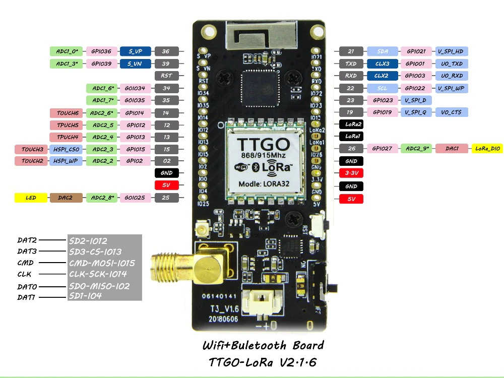

# Hardware

## Verwendete Hardware
* TTGO LoRa32 v2.1 Entwicklungsboard
* Bosch BME280 Sensor (Temperatur, Luftfeuchtigkeit, Luftdruck)

## Pinout TTGO LoRa32 v2.1

## Verbinden mit dem Bosch BME280

Der BME280 wird mit 3.3V, GND, SCL (Pin 22) und SDA (Pin 21) des Entwicklungsboards verbunden. Er verwendet damit gleichzeitig auch den Hardware I2C Bus des angeschlossenen Displays.

# Software

## Verwendete Bibliotheken

Um die Software zu kompilieren werden folgende Arduino Bibliotheken im Projekt verwendet. Die Installation kann mittels PlatformIO über den Menüpunkt *"Libraries"* erfolgen, im Projekt sind außerdem die entsprechenden Bibliotheken in der Datei *"platformio.ini"* gespeichert.  
Beispiele zu den installierten Bibliotheken finden sich im Unterordner *".pio/libdeps/\<Bibliothekname>/examples"*.

Ansteuerung des BME280:
* Adafruit BME280 Library (ID = 166)
* Adafruit Unified Sensor (ID = 31)

LoRaWAN Software Stack:
* LMIC-Arduino (ID=852)

Ansteuerung des Displays:
* U8g2 (ID=942)

Datenaufbereitung in das [Cayenne Low Power Payload (LPP) Format](https://developers.mydevices.com/cayenne/docs/lora/#lora-cayenne-low-power-payload)
* CayenneLPP (ID=1767, [API Referenz](https://www.thethingsnetwork.org/docs/devices/arduino/api/cayennelpp.html))
* ArduinoJson (ID=64)